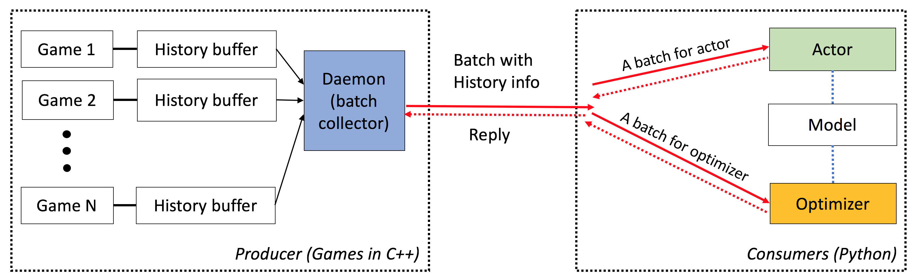

# ELF: An Extensive, Lightweight and Flexible Platform for Game Research

Overview
===============

ELF is an **E**xtensive, **L**ightweight and **F**lexible platform for game research, in particular for real-time strategy (RTS) games. On the C++-side, ELF hosts multiple games in parallel with C++ threading. On the Python side, ELF returns one batch of game state at a time, making it very friendly for modern RL. In comparison, other platforms (e.g., OpenAI Gym) wraps one single game instance with one Python interface. This makes concurrent game execution a bit complicated, which is a requirement of many modern reinforcement learning algorithms.

Besides, ELF now also provides a Python version for running concurrent game environments, by Python multiprocessing with ZeroMQ inter-process communication. See `./ex_elfpy.py` for a simple example. 

For research on RTS games, ELF comes with an fast RTS engine, and three concrete environments: MiniRTS, Capture the Flag and Tower Defense. MiniRTS has all the key dynamics of a real-time strategy game, including gathering resources, building facilities and troops, scouting the unknown territories outside the perceivable regions, and defend/attack the enemy. User can access its internal representation and can freely change the game setting.



ELF has the following characteristics:

* *End-to-End*: ELF offers an end-to-end solution to game research. It provides miniature real-time strategy game environments, concurrent simulation, intuitive APIs, web-based visualzation, and also comes with a reinforcement learning backend empowered by [Pytorch](https://github.com/pytorch/pytorch) with minimal resource requirement.  

* *Extensive*: Any game with C/C++ interface can be plugged into this framework by writing a simple wrapper. As an example, we already incorporate Atari games into our framework and show that the simulation speed per core is comparable with single-core version, and is thus much faster than implementation using either multiprocessing or Python multithreading. In the future, we plan to incorporate more environments, e.g., DarkForest Go engine.

* *Lightweight*: ELF runs very fast with minimal overhead. ELF with a simple game (MiniRTS) built on RTS engine runs **40K frame per second per core** on a MacBook Pro. Training a model from scratch to play MiniRTS **takes a day on 6 CPU + 1 GPU**.  

* *Flexible*: Pairing between environments and actors is very flexible, e.g., one environment with one agent (e.g., Vanilla A3C), one environment with multiple agents (e.g., Self-play/MCTS), or multiple environment with one actor (e.g., BatchA3C, GA3C). Also, any game built on top of the RTS engine offers full access to its internal representation and dynamics. Besides efficient simulators, we also provide a lightweight yet powerful Reinforcement Learning framework. This framework can host most existing RL algorithms. In this open source release, we have provided state-of-the-art actor-critic algorithms, written in [PyTorch](https://github.com/pytorch/pytorch).

Documentation  
=================
Check [here](http://yuandong-tian.com/html_elf) for detailed documentation. You can also compile your version in `./doc` using `sphinx`. 

Basic Usage  
==============
ELF is very easy to use. The initialization looks like the following:

```python
# We run 1024 games concurrently.
num_games = 1024

# Wait for a batch of 256 games.
batchsize = 256  

# The return states contain key 's', 'r' and 'terminal'
# The reply contains key 'a' to be filled from the Python side.
# The definitions of the keys are in the wrapper of the game.  
input_spec = dict(s='', r='', terminal='')
reply_spec = dict(a='')

context = Init(num_games, batchsize, input_spec, reply_spec)
```

The main loop is also very simple:

```python
# Start all game threads and enter main loop.
context.Start()  
while True:
    # Wait for a batch of game states to be ready
    # These games will be blocked, waiting for replies.
    batch = context.Wait()

    # Apply a model to the game state. The output has key 'pi'
    # You can do whatever you want here. E.g., applying your favorite RL algorithms.
    output = model(batch)

    # Sample from the output to get the actions of this batch.
    reply['a'][:] = SampleFromDistribution(output)

    # Resume games.
    context.Steps()   

# Stop all game threads.
context.Stop()  
```

Please check `train.py` and `eval.py` for actual runnable codes.

Dependency    
===============
C++ compiler with C++11 support (e.g., gcc >= 4.9) is required. The following libraries are required `tbb`. CMake is also required.

Python 3.x is required. In addition, you need to install following package: [PyTorch](http://pytorch.org/) version 0.2.0+, `tqdm`, `zmq`, `msgpack`, `msgpack_numpy`

How to train    
===============
To train a model for MiniRTS, please first compile `./rts/game_MC` (See the instruction in `./rts/` using `cmake`). Note that a compilation of `./rts/backend` is not necessary for training, unless you want to see visualization. 

Then please run the following commands in the current directory (you can also reference `train_minirts.sh`):

```bash
game=./rts/game_MC/game model=actor_critic model_file=./rts/game_MC/model \ 
python3 train.py 
    --num_games 1024 --batchsize 128                                                                  # Set number of games to be 1024 and batchsize to be 128.  
    --freq_update 50                                                                                  # Update behavior policy after 50 updates of the model.
    --players "fs=50,type=AI_NN,args=backup/AI_SIMPLE|delay/0.99|start/500;fs=20,type=AI_SIMPLE"      # Specify AI and its opponent, separated by semicolon. `fs` is frameskip that specifies How often your opponent makes a decision (e.g., fs=20 means it acts every 20 ticks)
                                                                                                      # If `backup` is specified in `args`, then we use rule-based AI for the first `start` ticks, then trained AI takes over. `start` decays with rate `decay`. 
    --tqdm                                                                  # Show progress bar.
    --gpu 0                                                                 # Use first gpu. If you don't specify gpu, it will run on CPUs. 
    --T 20                                                                  # 20 step actor-critic
    --additional_labels id,last_terminal         
    --trainer_stats winrate                                                 # If you want to see the winrate over iterations. 
                                                                            # Note that the winrate is computed when the action is sampled from the multinomial distribution (not greedy policy). 
                                                                            # To evaluate your model more accurately, please use eval.py.
```

Note that long horizon (e.g., `--T 20`) could make the training much faster and (at the same time) stable. With long horizon, you should be able to train it to 70% winrate within 12 hours with 16CPU and 1GPU.  You can control the number of CPUs used in the training using `taskset -c`. 

Here is one [trained model](http://yuandong-tian.com/model-minirts-212808.bin) with `T = 16`. Another [trained model](http://yuandong-tian.com/model-minirts-361745.bin) with 80% winrate against `AI_SIMPLE` for `fs_opponent=50`. Here is one game [replay](https://www.youtube.com/watch?v=YgZyWobkqfw). 

The following is a sample output during training:
```
Version:  bf1304010f9609b2114a1adff4aa2eb338695b9d_staged
Num Actions:  9
Num unittype:  6
100%|█████████████████████████████████████████████████████████████████████████████████████████████████████████████████████████████████████████████| 5000/5000 [01:35<00:00, 52.37it/s]
[2017-07-12 09:04:13.212017][128] Iter[0]:
Train count: 820/5000, actor count: 4180/5000
Save to ./
Filename = ./save-820.bin
Command arguments run.py --batchsize 128 --freq_update 50 --fs_opponent 20 --latest_start 500 --latest_start_decay 0.99 --num_games 1024 --opponent_type AI_SIMPLE --tqdm
0:acc_reward[4100]: avg: -0.34079, min: -0.58232[1580], max: 0.25949[185]
0:cost[4100]: avg: 2.15912, min: 1.97886[2140], max: 2.31487[1173]
0:entropy_err[4100]: avg: -2.13493, min: -2.17945[438], max: -2.04809[1467]
0:init_reward[820]: avg: -0.34093, min: -0.56980[315], max: 0.26211[37]
0:policy_err[4100]: avg: 2.16714, min: 1.98384[1520], max: 2.31068[1176]
0:predict_reward[4100]: avg: -0.33676, min: -1.36083[1588], max: 0.39551[195]
0:reward[4100]: avg: -0.01153, min: -0.13281[1109], max: 0.04688[124]
0:rms_advantage[4100]: avg: 0.15646, min: 0.02189[800], max: 0.79827[564]
0:value_err[4100]: avg: 0.01333, min: 0.00024[800], max: 0.06569[1549]

 86%|████████████████████████████████████████████████████████████████████████████████████████████████████████████████████████▉                    | 4287/5000 [01:23<00:15, 46.97it/s]
```

To evaluate a model for MiniRTS, try the following command (you can also reference `eval_minirts.sh`):
```bash
game=./rts/game_MC/game model=actor_critic model_file=./rts/game_MC/model \ 
python3 eval.py 
    --load [your model]
    --batchsize 128 
    --players "fs=50,type=AI_NN;fs=20,type=AI_SIMPLE"  
    --num_games 1024 
    --num_eval 10000
    --tqdm                          # Nice progress bar
    --gpu 0                         # Use GPU 0 as the evaluation gpu.
    --additional_labels id          # Tell the game environment to output additional dict entries.
    --greedy                        # Use greedy policy to evaluate your model. If not specified, then it will sample from the action distributions. 
```

Here is an example output (it takes 1 min 40 seconds to evaluate 10k games with 12 CPUs):
```
Version:  dc895b8ea7df8ef7f98a1a031c3224ce878d52f0_
Num Actions:  9
Num unittype:  6
Load from ./save-212808.bin
Version:  dc895b8ea7df8ef7f98a1a031c3224ce878d52f0_
Num Actions:  9
Num unittype:  6
100%|████████████████████████████████████████████████████████████████████████████████████████████| 10000/10000 [01:40<00:00, 99.94it/s]
str_acc_win_rate: Accumulated win rate: 0.735 [7295/2628/9923]
best_win_rate: 0.7351607376801297
new_record: True
count: 0
str_win_rate: [0] Win rate: 0.735 [7295/2628/9923], Best win rate: 0.735 [0]
Stop all game threads ...
```

SelfPlay
=============
Try the following script if you want to do self-play in Minirts:
```
sh ./selfplay_minirts.sh [your pre-trained model] 
```

Reference  
=============

When you use ELF, please reference the associated arXiv [paper](https://arxiv.org/abs/1707.01067).
