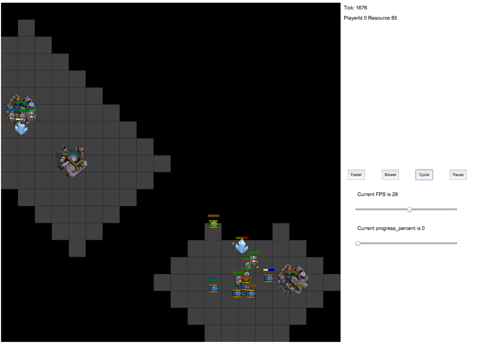

# RTS engines

Dependency
============

The simulators are written in C++11, so please compile using gcc >= 4.9.

The engine also comes with a web-based platform-independent visualization interface with JavaScript (thanks Qucheng Gong for getting this to work).
A backend runs in the terminal and communicates with the front-end webpage to drive the game and receive any keyboard/mouse feedbacks from the web interface.

How to compile
============

In directory `rts`, run the command: `mkdir build && cd build && cmake .. -DGAME_DIR=../game_MC && make`

To select the Python installation to compile with, use cmake flags `-DPYTHON_EXECUTABLE=/path/to/your/python`

To compile a debug version, try `cmake .. -DCMAKE_BUILD_TYPE=debug -DCMAKE_CXX_FLAGS=-fsanitize=address`.

You will see a dynamic library named `minirts` to be loaded by Python.
You need to copy this dynamic library to where you'll run your python scripts.
Similarly you can compile the other two games `./rts/game_TD` and `./rts/game_CF`.

Also you will see an executable `minirts-backend`, which is used for visualizations.

Usage of the standalone backend
============
Self-play
-------------
For game_MC:
Run `./minirts-backend selfplay` for a simple self-play between two identical rule-based AIs (SimpleAI). Use switch `--seed [num]` to change the initial game seed, which affects the initial quantities and locations of buildings and units for each player.
Run `./minirts-backend selfplay2` for a self-play between different AIs. Player 1 utilizes hit-and-run strategy and is significantly stronger than player 0(SimpleAI).

For game_CF:
Run `./minirts-backend flag_selfplay` for a simple selfplay of Capture the Flag game.

For game_TD:
Run `./minirts-backend td_simple --max_tick 3000` for a simple Tower Defense game.

Visualization
-------------

Open a server at port 8000: `./minirts-backend selfplay --vis_after 0`

and then open `./rts/frontend/minirts.html` in your browser. You should be able to see two `SIMPLE_AI` competing with each other, as shown in the following figure:

Human versus AI
-----------------------

Try `./minirts humanplay --vis_after 0` if you want to compete with the AI in the webpage. This is only implemented for game_MC.

Game play
===================

Shortcut
------------

1. Move
Click one unit, and click an empty place.

2. Attack
Click one unit, press `a` and click an enemy unit.
   a. No friendly fire. No “attack on ground” yet.
   b. The enemy unit will retaliate by attacking back.

3. Gather
Click one worker, press `t` and click on the resource.
The worker will move between base and resource with simple path-planning.

4. Build
   a. BASE: select and press `s` to produce worker.
   b. BARRACKS: select and press `m` for melee_attacker and `r` for range_attacker.
   c. WORKER: select, press `b`/`c` and click an empty place to build barracks / base.

Units
------------

1. Worker
Used to gather and build. Move slow. Also has decent strength as a combat unit.

2. Melee Attacker
Strong in combat but its attack range is 1.

3. Range Attacker
Fast movement, long attack range but has low HP. Hit-and-run possible.

Replay
===================

You can save and load replays.
Add option `--save_replay [replay_prefix]` to save a replay file when you run minirts.
Afterwards, you can load it with `./minirts replay --load_replay [your_rep_file] --vis_after 0` and then open minirts.html in your browser.

Click Faster or Slower, or drag the slider to adjust replay speed. Click Cycle to alternate player perspective. Click Pause to pause/unpause the game.
